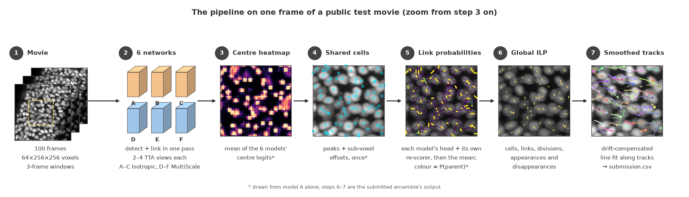
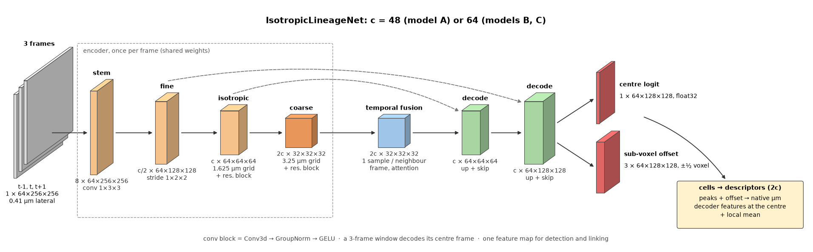
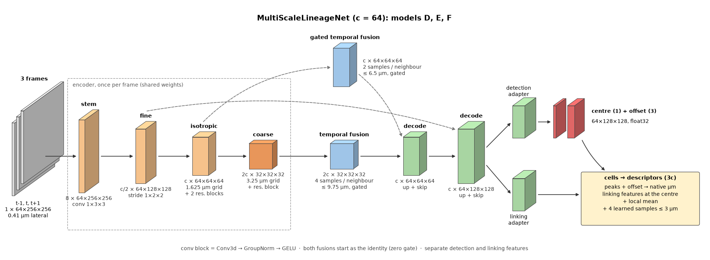
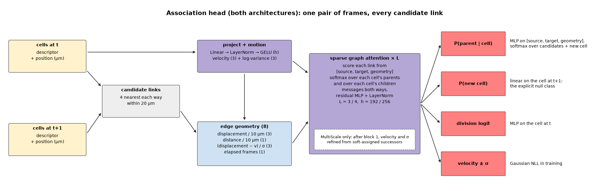

# Biohub cell tracking — 6th place solution

Inference and training code for our 6th-place solution to the Kaggle competition
[Biohub Cell Tracking During Development](https://www.kaggle.com/competitions/biohub-cell-tracking-during-development).
It predicts a cell lineage graph (cells and their frame-to-frame links and divisions)
for every 3D time-lapse movie and writes `submission.csv`.


| Variant | Model set | Private LB | Public LB |
|---|---|---|---|
| `fin` (default) | final selected submission | **0.953** | 0.961 |
| `best` | best-validation checkpoints | 0.955 | 0.958 |

Both variants reproduce their Kaggle submissions byte for byte on the 4 public test
movies (Kaggle 2×T4).

**The solution, step by step, with figures: [docs/SOLUTION.md](docs/SOLUTION.md).**

## Links

| | |
|---|---|
| Code (this repository) | https://github.com/jamal-saeedi/biohub_cell_tracking_kaggle |
| Write-up | [docs/SOLUTION.md](docs/SOLUTION.md) |
| Models (MIT) | https://www.kaggle.com/models/jamalsaeedi/biohub-cell-tracking |
| Code dataset (package + pinned wheels) | https://www.kaggle.com/datasets/jamalsaeedi/biohub-cell-tracking-kaggle |
| Kaggle notebook | https://www.kaggle.com/code/jamalsaeedi/biohub-cell-tracking-inference |
| Competition | https://www.kaggle.com/competitions/biohub-cell-tracking-during-development |

## Method in brief



1. **Six 3D networks** (three `IsotropicLineageNet`, three `MultiScaleLineageNet`)
   read 3-frame windows at native resolution. Each predicts cell centres and, for
   every cell, a probability over its candidate parents in the previous frame plus an
   explicit "new cell" class, a division score and a velocity.
2. **Ensemble.** The networks' centre maps are averaged into one set of cells; each
   network scores the same candidate links with its own head and its own
   gradient-boosted re-scorer; the probabilities are averaged.
3. **Global solve.** An event ILP (cells, appearances, disappearances, links,
   divisions) over the whole movie, solved LP-first; the link cost includes a
   stage-drift-corrected distance.
4. **Post-processing.** Drift-compensated line-fit smoothing along tracks.
5. **Training.** Three-state detection targets for the 3 % annotation, a count prior,
   and several teacher → student rounds in which the teacher is the whole pipeline
   above and its tracks become pseudo-labels.

### The two networks





Both use the same association-head design to link the cells of two consecutive
frames (the MultiScale head adds in-graph motion refinement):



| | IsotropicLineageNet | MultiScaleLineageNet |
|---|---|---|
| models | A (c 48), B, C (c 64) | D, E, F (c 64) |
| parameters | 2.47 M, 4.38 M, 4.78 M | 5.68 M |
| temporal fusion | one learned sample per neighbour frame, coarse grid | gated, on the coarse and the 1.625 µm grid |
| linking features | the detector's | own adapter + learned descriptor samples |

## Layout

```
├── README.md
├── LICENSE                     MIT
├── CITATION.cff                how to cite
├── requirements.txt            pinned dependencies
├── entry_points.md             every command, what it reads and writes
├── directory_structure.txt     repository and runtime layout
├── SETTINGS.json               input / output paths (local and Kaggle)
├── pyproject.toml              package, pinned dependencies, command-line tools
├── docs/
│   ├── SOLUTION.md             the write-up
│   ├── MODEL_SUMMARY.md        model summary (Kaggle winner documentation)
│   └── figures/
├── notebooks/
│   ├── inference.ipynb         local and Kaggle inference
│   └── training.ipynb          training walkthrough (runs on CPU on synthetic data)
├── recipes/
│   ├── train/                  one training configuration per model of the lineage
│   └── ensembles/              teacher ensembles of each pseudo-label set; fin / best
├── src/biohub_tracking/
│   ├── cli.py                  biohub-predict
│   ├── labels.py               biohub-pseudo-labels
│   ├── ensembles.py            ensemble specs -> inference configs
│   ├── recipe.py               the shipped variants and their file hashes
│   ├── settings.py
│   ├── submission.py           CSV writing and validation
│   ├── tracking_io.py          movie and graph I/O
│   ├── isotropic/              decoding, ensemble, re-scorer, ILP, pipeline, sharding
│   ├── models/                 the two network architectures
│   ├── postprocess/            smoothing
│   └── training/               data, targets, losses, trainer (biohub-train),
│                               re-scorer training (biohub-train-rescorer)
└── tools/
    ├── download_models.py      models from Kaggle Models into MODEL_DIR
    ├── reproduce_training.sh   the full training lineage, step by step
    ├── smoke_test.py           every stage end to end on synthetic data (CPU)
    ├── make_synthetic_data.py
    ├── build_kaggle_dataset.py the Kaggle code dataset
    └── kernel-metadata.json    the Kaggle notebook
```

## Install

Linux, Python 3.12, an NVIDIA GPU with 16 GB for inference (V100 and T4 tested) or
24 GB for training (RTX 3090 / 4090).

```bash
pip install -e ".[download,train]"
```

or, with every version pinned as in the submissions:
`pip install -r requirements.txt && pip install -e . --no-deps`.

## Inference

```bash
python tools/download_models.py            # both variants into models/
```

Put the test movies (`<stem>.zarr`) in `data/test/`, or edit `SETTINGS.json`:

| Key | Default | |
|---|---|---|
| `TEST_DATA_DIR` | `data/test` | input movies |
| `MODEL_DIR` | `models` | model files (`<MODEL_DIR>/<handle>/<version>/...`, e.g. `models/mres-fin-444322/1/`) |
| `SUBMISSION_DIR` | `outputs` | `submission.csv` |
| `WORK_DIR` | `outputs/work` | per-movie predictions |

```bash
biohub-predict                       # variant fin
biohub-predict --variant best
```

or run `notebooks/inference.ipynb` (`VARIANT` in its first code cell); both run the same
code. Options: `--movies STEM ...`, `--num-shards N` (GPU processes, default one per
GPU), `--settings PATH` (or `BIOHUB_SETTINGS`), and `--ensemble SPEC --runs DIR
--rescorers DIR` to predict with models you trained yourself. On one V100 the 4
public test movies take about 13 minutes.

**On Kaggle:** open the [notebook](https://www.kaggle.com/code/jamalsaeedi/biohub-cell-tracking-inference)
and *Copy & Edit*, or `kaggle kernels push -p tools`. It attaches the competition
data, the code dataset and both model variations, installs the pinned wheels
offline and writes `/kaggle/working/submission.csv` (GPU T4 ×2).

## Training

The training data is the competition's `train/` directory (`<stem>.zarr` +
`<stem>.geff` for 199 movies) next to its `test/` directory; the 4 public test movies
appear in both and are always kept out of training and pseudo-labelling.

### Smoke test first

```bash
python tools/smoke_test.py
```

Runs every stage below on synthetic movies with shrunken models, on CPU, in a few
minutes, ending with a validated `submission.csv`. `notebooks/training.ipynb` walks
through the same steps with plots.

### The four tools

| step | command | input | output |
|---|---|---|---|
| train a model | `biohub-train --recipe recipes/train/<run>.json` | movies; optionally a pseudo-label set and an initial checkpoint | `<out>/<run>/{best,last}.pt`, `history.json` |
| fit re-scorers | `biohub-train-rescorer --ensemble recipes/ensembles/<spec>.json --names <one per model>` | trained models; validation movies | one `<name>.npz` per model |
| make pseudo-labels | `biohub-pseudo-labels --ensemble recipes/ensembles/<set>-teacher.json` | a teacher ensemble (models + re-scorers) | one `<stem>.npz` per training movie |
| predict | `biohub-predict --ensemble recipes/ensembles/fin.json --runs ... --rescorers ...` | trained models + re-scorers | `submission.csv` |

Example: one round of teacher → student.

```bash
# a model on the ground truth
biohub-train --recipe recipes/train/W-link-s2.json \
    --train-dir data/train --competition-dir data --out-dir outputs/training

# its tracks on every training movie become pseudo-labels
biohub-pseudo-labels --ensemble recipes/ensembles/W-link-s2-teacher.json \
    --runs outputs/training --train-dir data/train --competition-dir data \
    --out outputs/pseudo_labels/W-link-s2

# a student on ground truth + pseudo-labels
biohub-train --recipe recipes/train/P-l50-s2.json \
    --train-dir data/train --competition-dir data --out-dir outputs/training \
    --pseudo-dir outputs/pseudo_labels/W-link-s2
```

A recipe records everything that defines a run (architecture, data, augmentation,
losses, optimiser, split seed) plus what it needs from earlier steps (`requires`:
an initial checkpoint, a pseudo-label set) and the digest of its split on the full
training set. `--set key=value` overrides any setting; `--smoke` shrinks any recipe.

### Reproducing the shipped models

```bash
DATA=data OUT=outputs bash tools/reproduce_training.sh
```

runs the whole lineage in order: a ground-truth-only model, three rounds of one-model
teachers, students on new splits and architectures, the two ensemble teachers (label
sets v10 and v11), the six final models, and the re-scorers of both submissions
(about a week of single-GPU time; independent runs can go in parallel). Training is
deterministic per GPU architecture, not across architectures, so retrained weights
follow the same method but are not bit-identical to the shipped files.

## Environment

The submissions ran in the Kaggle Python image
`gcr.io/kaggle-private-byod/python@sha256:37c64f7dd9c54116ecd1bcc88817c5469b88387388fade02bfa8bf3fc647d461`
(torch 2.10.0+cu128, numpy 2.0.2, scipy 1.16.3, pandas 2.3.3, Python 3.12) plus the
wheels in the code dataset (numba 0.65.1, polars 1.42.0, pyscipopt 6.2.1, ilpy 0.6.0,
zarr 3.2.1, tracksdata 0.1.0rc6.dev3+g980c2d30a). `pyproject.toml` pins the same
versions (tracksdata by its git commit; it brings in ilpy, 0.6.0 in the code dataset);
training also needs
LightGBM 4.7.0 for the re-scorers. Results are
deterministic for a given GPU architecture; on a V100 the coordinates differ slightly
from the T4 runs and the score on the public test movies is the same.

## License

MIT, see [LICENSE](LICENSE).

## Citation

If you use this code or the models, please cite the solution:

```bibtex
@misc{saeedi2026biohubtracking,
  author       = {Saeedi, Jamal},
  title        = {Biohub - Cell Tracking During Development: 6th Place Solution},
  year         = {2026},
  howpublished = {Kaggle competition write-up},
  url          = {https://www.kaggle.com/competitions/biohub-cell-tracking-during-development}
}
```

The methods and tools the solution builds on are cited in
[docs/SOLUTION.md](docs/SOLUTION.md#references).
